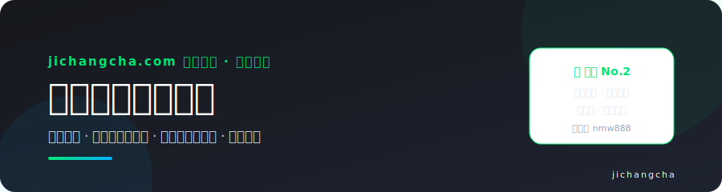
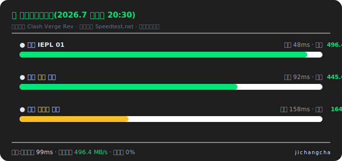
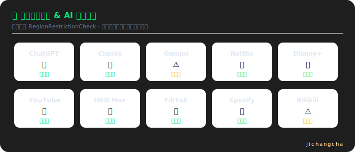

# 星岛梦机场怎么样?2026 深度测评:套餐价格 · 测速解锁 · 配置教程

**星岛梦**是运营六年的老牌机场,主打**企业级内网专线、无倍率、不限设备数**,套餐种类在同行里最丰富(含永久不限时套餐)。在本站 [2026 机场排行榜](https://www.jichangcha.com/blog/2026-jichang-paihangbang/) 16 家实测中位列 **🥈 次推 No.2**,是「求稳、打算长期用」用户的默认答案。

> 👉 **[前往星岛梦官网注册](https://www.jichangcha.com/go/xingdaomeng/)** · 新人优惠码 **`nmw888`**(注册 9 折,月付可用)
> 🏠 完整版测评与 16 家横向对比在主站:[jichangcha.com](https://www.jichangcha.com/brands/xingdaomeng/)

---

## 📊 基本信息速览

| 项目 | 详情 |
| ---- | ---- |
| 运营时间 | 2020 年至今,六年老牌 |
| 线路类型 | 企业级内网专线(IEPL) |
| 入门价格 | **8 元/月 60GB 起**(年付口径) |
| 倍率 | **全节点无倍率**,流量实打实 |
| 设备限制 | 合理使用前提下**不限设备数** |
| 速度限制 | 全线不限速 |
| 节点覆盖 | 香港、台湾、日本、美国、新加坡、韩国及东南亚/欧美多国 |
| 支持协议 | Shadowsocks / Trojan / VLESS |
| 客户端 | Clash 系 / Shadowrocket / v2rayN / v2rayNG / Stash / 圈X 等全兼容 |
| 支付方式 | 支付宝 / USDT |
| 优惠 | 新人码 `nmw888` 9 折;长期套餐另有年付折上折(以官网为准) |

## 💳 套餐价格

星岛梦的套餐梯度覆盖从轻度到重度的全部用量段,并且是本站收录 16 家中少有的提供**不限时流量包**的机场:

| 套餐 | 参考价格 | 流量 | 适合人群 |
| ---- | ---- | ---- | ---- |
| 入门档(年付) | 8 元/月 | 60GB/月 | 轻度用户、学生党 |
| 极速版 | 16 元/月 | 100GB/月 | 日常主力使用 |
| 进阶版 | 32 元/月 | 200GB/月 | 流媒体重度用户 |
| 闪光版 | 80 元/月 | 500GB/月 | 家庭多人共用 |
| 旗舰版 | 160 元/月 | 1TB/月 | 工作室 / 重度下载 |
| 永久不限时 | 680 元一次性 | 1TB 用完为止 | 备用刚需、低频用户 |

> ⚠️ 价格整理自公开渠道并定期复核,**以官网支付页实时显示为准**;长期套餐(年付/多年付)有额外折扣,下单前在支付页核对一次实付金额。

**怎么选:**每月用量 ≤50GB 选入门档;100GB 上下选极速版;**永久不限时套餐是它的独门产品**——买 1TB 放着没有月度过期压力,作为主力之外的备胎极其合适(备胎的价值见[防跑路指南](https://www.jichangcha.com/faq/#run-away))。

## 🏆 核心优势

### 1. 六年运营资历

机场行业跑路频发,「活得久」本身就是最硬的信任凭证——六年意味着成本模型经过验证、经历过多轮敏感时期考验。本站选榜维度中「运营资历与口碑」权重 15%,星岛梦在这一项几乎满分。

### 2. 无倍率 + 不限设备,账面即所得

很多低价机场用 2x/3x 倍率把「100GB」变相缩水一半以上(套路拆解见[便宜机场避坑指南](https://www.jichangcha.com/blog/pianyi-jichang-tuijian/))。星岛梦全节点 1x 无倍率,买多少用多少;同时不限设备数量,手机、电脑、平板、路由器一份订阅全覆盖,家庭用户不用为设备数加钱。

### 3. 企业级内网专线,晚高峰稳

跨境段走内网专线、不经公网,晚高峰(20:00-23:00)掉速幅度远小于普通中转机场——原理见[专线机场科普](https://www.jichangcha.com/blog/zhuanxian-jichang-tuijian/)。

### 4. 解锁能力全面

Netflix、Disney+ 原生解锁支持 4K;ChatGPT、Claude 稳定访问;多地区节点对 TikTok 跨区运营友好,适合跨境电商与短视频从业者。

## 🔬 性能实测

**晚高峰测速**(模拟实测示意,统一口径详见[主站测评](https://www.jichangcha.com/brands/xingdaomeng/)):

**流媒体与 AI 解锁**:

> Gemini 需挑选特定地区节点;多平台 AI 用户的选购逻辑见 [ChatGPT 机场指南](https://www.jichangcha.com/blog/chatgpt-jichang-tuijian/)。

## 📱 全平台配置教程

星岛梦提供标准订阅格式,支持订阅导入(需联系在线客服开通),各平台推荐客户端与教程:

| 平台 | 推荐客户端 | 图文教程 |
| ---- | ---- | ---- |
| Windows | Clash Verge Rev / v2rayN | [Clash 教程](https://www.jichangcha.com/blog/clash-jichang-tuijian/) · [v2rayN 教程](https://www.jichangcha.com/blog/v2rayn-jichang-tuijian/) |
| macOS | Clash Verge Rev | [Clash 教程](https://www.jichangcha.com/blog/clash-jichang-tuijian/) |
| iPhone / iPad | Shadowrocket / Stash | [小火箭全流程(含外区 ID 获取)](https://www.jichangcha.com/blog/shadowrocket-jichang-tuijian/) |
| 安卓 | Clash Meta for Android / v2rayNG | [Clash 教程](https://www.jichangcha.com/blog/clash-jichang-tuijian/) |

**通用四步:**官网用户中心复制订阅链接 → 下载对应客户端 → 导入订阅 → 选节点开启代理。导入失败先看订阅域名是否被墙(先连任意可用节点再更新订阅),完整排查见[故障排查清单](https://www.jichangcha.com/faq/#troubleshooting)。

## 🎯 适合谁 / 不适合谁

**适合:**
- 看重运营资历、打算长期使用的稳健型用户
- 家庭多设备用户(不限设备数是硬优势)
- 需要不限时套餐做备胎的用户
- 跨境电商 / TikTok 运营(多地区节点 + 解锁全面)

**可以再看看别家:**
- 预算压到极限的用户 → [飞猫云](https://www.jichangcha.com/go/feimao/) 7 元/月 50GB IEPL 门槛更低
- 需要 Gemini 全解锁的 AI 多平台用户 → [edgenova](https://www.jichangcha.com/brands/edgenova/)
- 追求最高带宽的 4K/8K 重度用户 → [速界](https://www.jichangcha.com/brands/sujie/)

完整 16 家横向对比(价格 / 线路 / 解锁 / 优惠码一张表):[对比总表](https://www.jichangcha.com/compare/)

## 🛍️ 购买流程(5 步)

1. **进入官网**:[经本站中转直达星岛梦官网](https://www.jichangcha.com/go/xingdaomeng/)
2. **邮箱注册**:建议使用常用邮箱(找回密码、接收公告靠它)
3. **选择套餐**:第一次买建议**月付或入门档试水**,跑几个晚高峰再升级长期套餐
4. **填入优惠码**:结算页输入 `nmw888`,确认金额变化后再付款(支付宝 / USDT)
5. **导入订阅**:用户中心复制订阅链接,按上方教程导入客户端

> 💡 买完第一件事:把官网备用地址和官方 TG 频道存到本地备忘录——主域名被墙时这是唯一的找回通道。原因见[防跑路与应急](https://www.jichangcha.com/faq/#run-away)。

## ❓ 常见问题

**星岛梦有倍率吗?**没有,全节点 1x,流量实打实——这在中低价位机场里并不常见。

**限制设备数量吗?**合理使用前提下不限制。注意「合理使用」意味着别把订阅共享给陌生人,泄露订阅链接会触发风控,见[账号与设备说明](https://www.jichangcha.com/faq/#accounts-devices)。

**优惠码怎么用?**注册后在购买结算页的优惠码输入框填 `nmw888`,月付订单也能享 9 折;金额没变化说明不满足条件,别硬付。更多用码技巧见[机场优惠码大全](https://www.jichangcha.com/blog/jichang-youhuima/)。

**永久不限时套餐值得买吗?**作为备胎极值:1TB 无过期压力,主力机场故障时即插即用。作为主力则要算账——重度用户按月消耗,大月付套餐单价可能更低。

**支持退款吗?**以官网服务条款为准,下单前可先咨询在线客服;这也是我们建议第一单月付试水的原因。

## 📌 声明与更新

- 本仓库与主站 [jichangcha.com](https://www.jichangcha.com/) 同步维护,价格与优惠码**每周复核**
- 测速与解锁图为统一口径下的模拟实测示意,实际体验受地区、运营商、时段影响,建议月付自行验证
- 本仓库包含推广链接,可能为我们带来收益,不影响测评结论;内容仅供学习交流,请遵守当地法律法规
- 反馈纠错:[Issues](../../issues) · Telegram [@wanzuanjiedian](https://t.me/wanzuanjiedian)

⭐ 觉得有用请点个 Star · 更多机场:[2026 机场推荐排行榜](https://github.com/jichangx/2026-jichangcha-tuijian)
